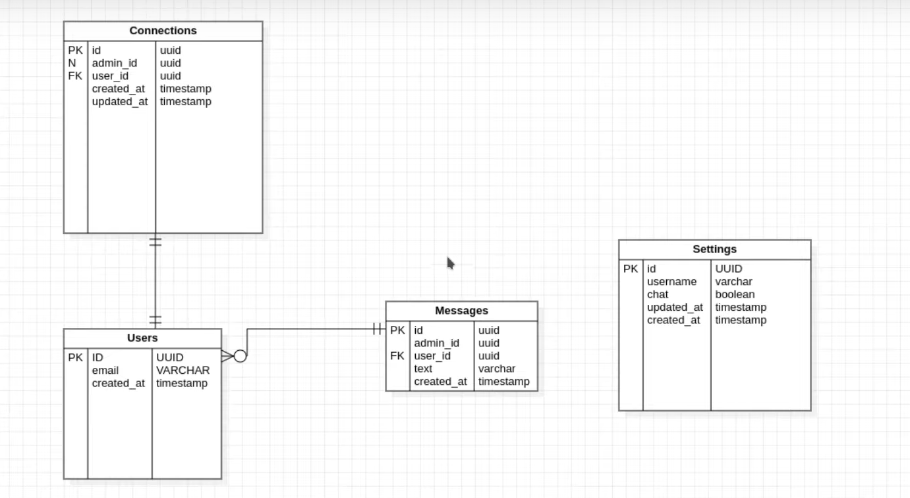

# NLW-NodeJS
 Semana do Next Level Week da Rocket Seat da trilha do NodeJS

 ## Aula 1 -Liftoff
 Projeto da Criação do Back-end de Chat

 Assuntos abordados na aula:
    - O que é o projeto?
    - O que é NodeJS?
    - O que é uma API?
    - Uso do TypeScript
    - Criação do projeto
        - Conhecer tipos de métodos
        - Criação da primeira rota
        - Rota POST
        - Configuração do visualizador de método Post (Insomnia ou Postman)

 
 ### Dia 1 - Fundamentos do NodeJS

Vamos desenvolver uma aplicação back-end de um chatbot utilizando WebSocket 

 Neste primeira etapa foi apresentado conceitos sobre API, NodeJS, WebSocket e HTTP

 Instalação de Bibliotecas, utilizando o Yarn foram instaladas as seguintes depedências no projeto

 Depedências utilizadas:
 - Express
 Depedências de desenvolvimento:
 - @types/express
 - ts-node-dev
 - typescript

Métodos que vai ser utilizada no projeto para criar as rotas:

- GET    =  Buscas
- POST   =  Criações
- PUT    =  Alterações
- DELETE =  Deletar
- PATCH  =  Alterar uma informação específica

No projeto iremos utilizar bastante o conceito de retorno os métodos em JSON

## Aula 2 - Maximum Speed

Assuntos abordados na aula:

 - Formas de trabalhar com Banco de Dados
 - TypeORM
 - O que são migrations
 - Criação de migrations
 - Criação de entidades
 - Criação de repositórios
 - Criação de rota de configurações

### Dia 2 - Iniciando com o Banco de Dados

Iremos trabalhar com banco de dados relacional e utilizar o Postgres.js

Framework a ser utilizado para o banco de dados:

Documentação do TypeORM: https://typeorm.io/#/

- TypeORM
    Um framework ORM é um modelo/classe da nossa aplicação e do banco
    ex: Se você possui um objeto chamado ("Usuário") na sua aplicação e uma tabela chamada ("Usuário") no seu banco,
        o framework conecta a tabela com o objeto dentro da aplicação ou seja ele faz um mapeamento da aplicação com a estrutura do banco de dados

Depedências acrescentadas no projeto:

- TypeORM
- reflect-metadata (Vai auxiliar na parte dos anotations para utilizar no banco)
- sqlite3

Foi configurado uma pasta de Conexão na chamada Database e configuração do ORM com o arquivo "ormconfig.json"

O que é migrations?
    - É um gerenciamento ou histórico a tudo que foi criado/atualizad/removida em relação ao banco de dados
    - O banco consegue verificar através de um histórico e consegue manter os banco de dados atualizados
    - São históricos em relação ao banco de dados

Esquema do Banco de Dados

Migrartions:

Para criar uma migration utiliza-se o comando (yarn/npm) typeorm migration:create -n (nome da migration)

A estrutura do migration tem duas funções async (up e down)

Estrutura UP:

    public async down(queryRunner: QueryRunner): Promise<void> {
        /// Tabelas a serem executadas aqui
    }

Up - Vai rodar tudo que tiver dentro do método Up, toda vez que para criar a migration, necessita ser executado no Up
     Comando para executar o método de migration - yarn/npm typeorm migration:run

Estrutura Down:

    public async down(queryRunner: QueryRunner): Promise<void> {
        /// Tabelas a serem excluidas(revertidas) aqui

    }

Down - Deu alguma coisa errada ou precisa reverter algo, colocar toda a estrutura dentro do down
     Comando para executar o revert yarn/npm migration:revert

Para criar uma tabela utiliza dentro do método up

        await queryRunner.createTable({
            name: (nome da tabela),
            columns: [
                {
                    name: "nome da coluna",
                    type: "tipo de dado",
                    isPrimary: true or false "Se é a Primary Key"
                    default: "valor padrão"
                }
            ]
        })

Esses valores são criado dentro do UP, caso necessita remover a tabela, somente colocar dentro do método down:

    await queryRunner.dropTable("nome da tabela")

UUID - Identificador Único

Utilizaremos o beekeeper para facilitar a manipulação do banco de dados

Foi criado uma pasta entities para colocar as entidades do banco

Para conseguir utilizar o ts nas entities é necessário alterar descomentar duas config no tsconfig.json
    "experimentalDecorators": true,              /* Enables experimental support for ES7 decorators. */
    "emitDecoratorMetadata": true, 

Após isso você consegue utilizar os relacionamentos

Importo as relações do typeorm:

import { Entity, Column, CreateDateColumn, UpdateDateColumn, PrimaryColumn} from "typeorm"

@Entity("De qual tabela é entidade")
class NomedaEntidade {
    // Definindo primary Key da Tabela
    @PrimaryColumn()
    id: string;

    @Column()
    nomeDaColuna: tipo da coluna;

    @UpdateDateColumn // @CreateDateColumn
    updated_at or created_at: Date; // Definir sempre eles como Date
}

Para definir os id poderiamos deixar a responsabilidade pro banco de dados, mas não temos certeza de como sera o comportamento dos bancos, definiremos que o projeto ira definir o uuid para poder nós não precisamos preocupar com qual banco iremos utilizar no projeto

Adicionaremos a biblioteca UUID ao projeto

Depedência a ser acrescentada:
- uuid
- @types/uuid - D
Ele também possui tipagems de desenvolvimento também ira ser acrescentada ao projeto

a V4 do uuid utiliza-se números aleatórios para criar id e para importa os mesmos utiliza-se:

import { v4 as uuid } from "uuid"

Foi criada uma classe de construtor para verificar se o Id da Setting está preenchido, pois quando trabalhamos com atualização, ele irá simplesmente verificar e manter o id ao invés de sempre gerar um id diferente toda vez que for atualizado

Uma config importante para definir no ormconfig.json é mapear suas entidades

Quando falamos de repositório em programação é uma estrutura de classe que é responsável por toda manipulação de dados da aplicação

Os repositórios são responsáveis pela comunicação entre a nossa entidade e nossa tabela do banco de dados

No repository utilizaremos uma classe estendida o Repository de dentro do ORM, e essa classe possui ja varios padrões configurado, como Create,Save,Select,etc...

import { Repository } from "typeorm";

@EntityRepository(Setting)
class SettingsRepository extends Repository<Passar o tipo de entidade aqui>{

}

Criado também um arquivo de router.ts na raiz do src para definir as rotas da aplicação importando o Router do Express

Quando trabalhamos com requisições trabalhamos com 3 paramêtros

Routes Params = Paramêtros de rotas
    ex: http://localhost:3333/settings/1
Trata-se de um paramêtro de rota onde ele é definido seu paramêtro pela rota(GET)

Query Params = Filtros e Buscas
    ex:http://localhost:3333/settings/1?search=qualquer&coisa
Trata-se de paramêtros que vem depois da rota, onde possui "?", onde é baseado em chave e valor, espaço são separados por "&", são utilizados para filtros e buscas

Body Params = Inserir objetos dentro das requisições, sempre por meio de JSON

No express é preciso definir para aceitar requisições através de JSON's

app.use(express.json())

OBS: Na hora de salvar os dados de data, ele vem com 3 horas a mais do horário do Brasil, é necessário ajustar o GMT, por padrão ele utiliza o padrão UTC

Para separar melhor o projeto iremos criar o controller

Controller é uma classe de comunicação entre a rota e o repositório

## Aula 3 - In Orbit

Assuntos abordados na aula:
    - Separar a regra de negócio de settings
    - Criar estrutura de user
    - Criar estrutura de connections
        - Relacionamento One to One
    - Criar estrutura de messages
        - Relacionamento Many to One

### Dia 3 - Continuando a nossa aplicação

Retirando do controller as funções de settings para poder usar-lo como sua real função onde vai ser o comunicador entre eles
Foi criado o SettingsServices para as regras de negócio da aplicação, todas as verificações da regra de negócio

Criado alguns métodos de comparação e restrição como:
- Verificação de Usuário
- Criando usuário e verificando se tem chat disponivel

Nos SettingsController foi criado uma tratativa de erro para verificar se usuário ja existe em um try() e catch()

Foi criado uma migration para cadastrar tabela CreateUsers, é importante utilizar o ID como Primary Key, pois ele vai ser usada como tabela de relacionamento

Preciso fixar conhecimento meu em relação a estrutura do src, e entender de fato o conceito de:
- Controller
- entities
- repositories
- services
- database
routes
server

Principalmente as 5 bases de organização de arquivos

Continuar video a partir do 32:17